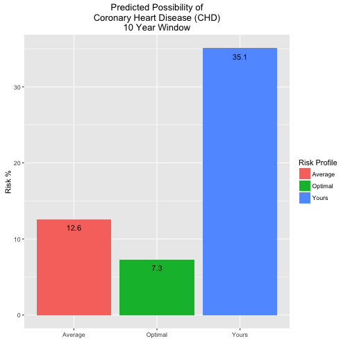

## Motivation: Why Build a CHD risk calculator?

1. Yearly physical: Cholesterol levels were higher than they should be
2. Lack of easy to use, interactive heart health model
3. Need to easily test "what-if" scenarios

## Sources 

1. "Toy" data subset referenced by Edx's and MIT's "<a href="https://www.edx.org/course/analytics-edge-mitx-15-071x-2">The Analytics Edge</a>" course
2. Ultimate source of data is <a href="http://www.framinghamheartstudy.org/">Framingham heart study</a>.

--- .class #id 

## Example Output from source.R

Shiny app calculates risk locally using javascript in the client (based on glm(...)  regression analysis in R), then requests server to update the risk comparison bar chart:

--- .class #id 

## Next Steps: Improving the CDH Risk Calculator

While the first working prototype of CDH Risk Calculator is novel and useful, end users would benefit from additional functionality:

1. Add concrete references and links to definitive research on reducing risk of CDH
2. Add interactions between calculator inputs and mitigating factors section: recommendations would be personalized according to user's health profile.
3. Add automatic updating and comparison of "before" and "after" states - related to #2
4. Build a more robust and accurate model based on full Framingham dataset, e.g., allow for inclusion of glucose and BMI coefficients.

--- .class #id 

## Links

Try out a working prototype of a CHD Risk Calculator <a href="https://rpruiz.shinyapps.io/CHDCalculator/">here</a>.

App repo can be found <a href="https://github.com/unique-account-name/jh-ds-cdp-chd-calculator">here</a>.

